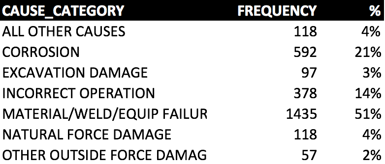
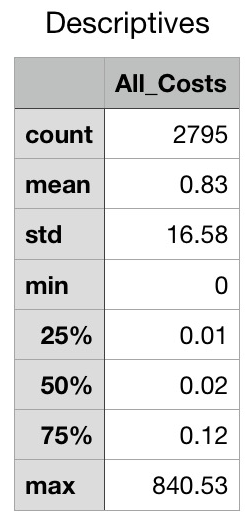
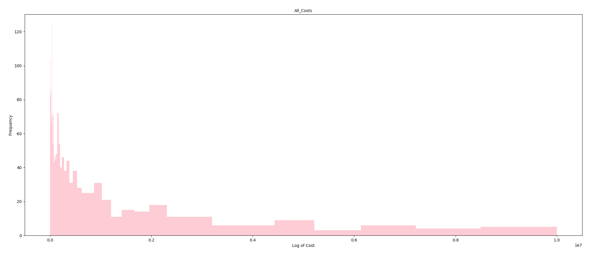
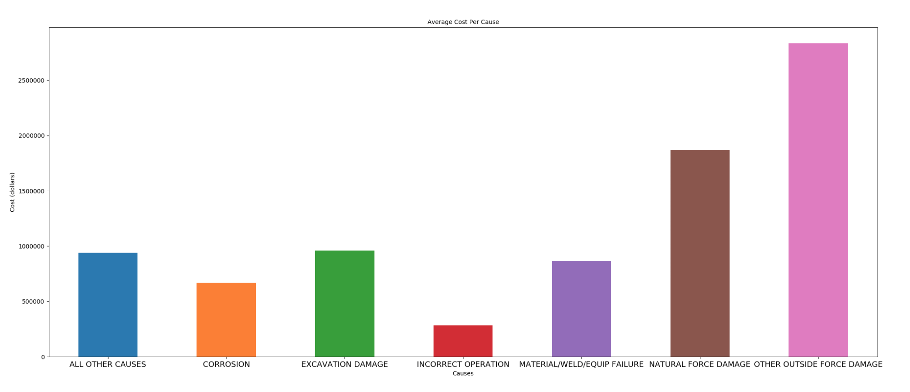
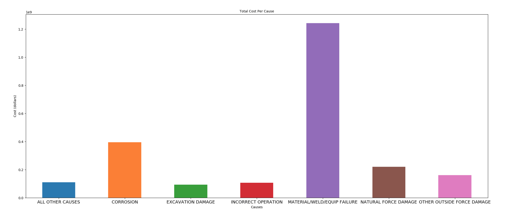

**Getting to Know our Data:**

* Looked at all variables
* Determined what sounded interesting: $$$

**Questions:**

*	How do oil spills happen?
* What types of oil spills happen more often?
*	Are different types of oil spills more expensive?

**Exploratory Analysis:**
* Understand the frequency of different causes of spills

	
*	Explore cost statistics

	

**Primary Analysis:**
*	Are different types of oil spills more expensive?

**Conclusions**
* Some spills are most expensive than others
* " Most expensive" depends on your metric

**Future Direction:**
*	Explore data on different types of costs

 * Property Damage, Environmental Remediation, Lost Commodity
* Perform inferential statistics to compare oil spill costs
